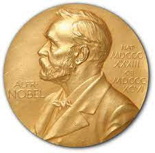

# Datacamp Project: History_of_Nobel_Prize_Winners
The Nobel Prize is perhaps the world's most well known scientific award. Every year it is given to scientists and scholars in chemistry, literature, physics, medicine, economics, and peace. The first Nobel Prize was handed out in 1901, and at that time the prize was Eurocentric and male-focused, but nowadays it's not biased in any way. Surely, right?

Well, let's find out! What characteristics do the prize winners have? Which country gets it most often? And has anybody gotten it twice? It's up to you to figure this out.

The dataset used in this project is from The Nobel Foundation on Kaggle.
 

